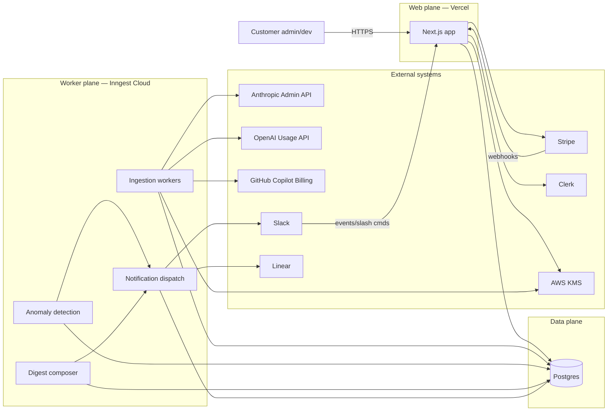
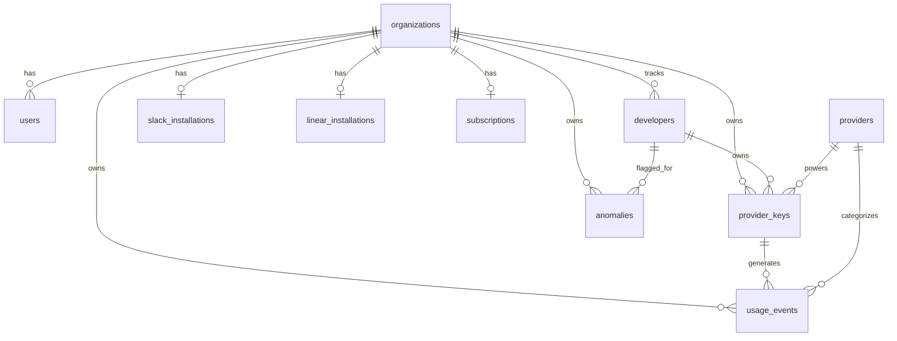
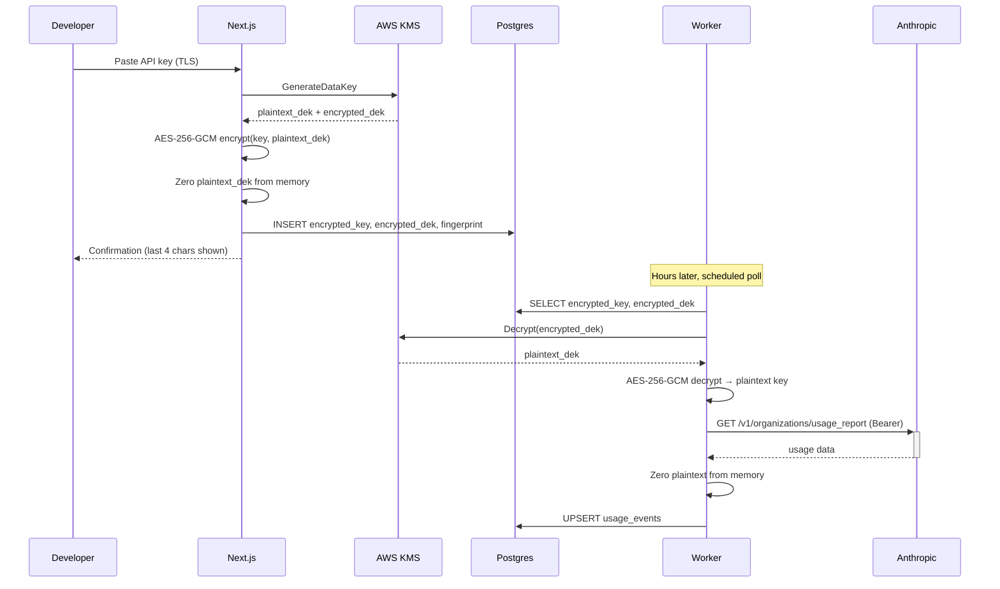
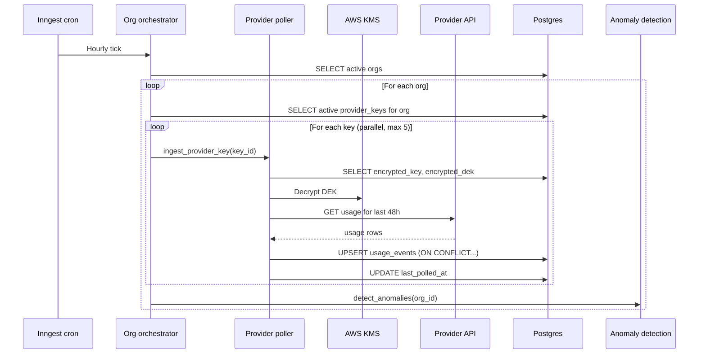
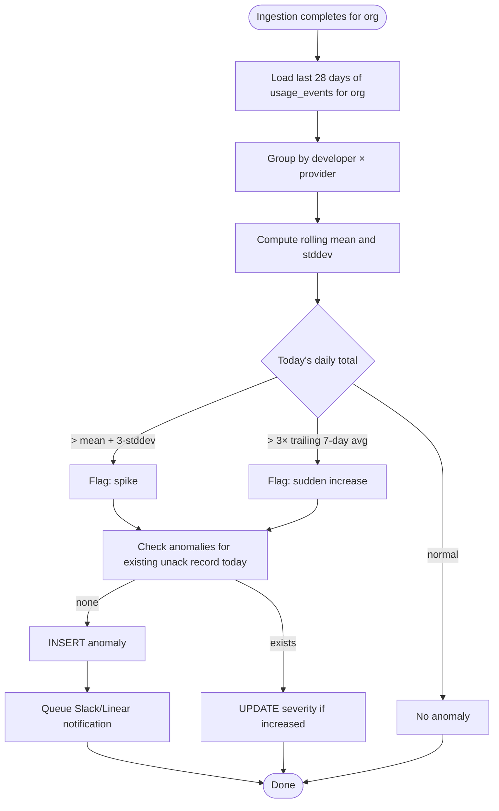
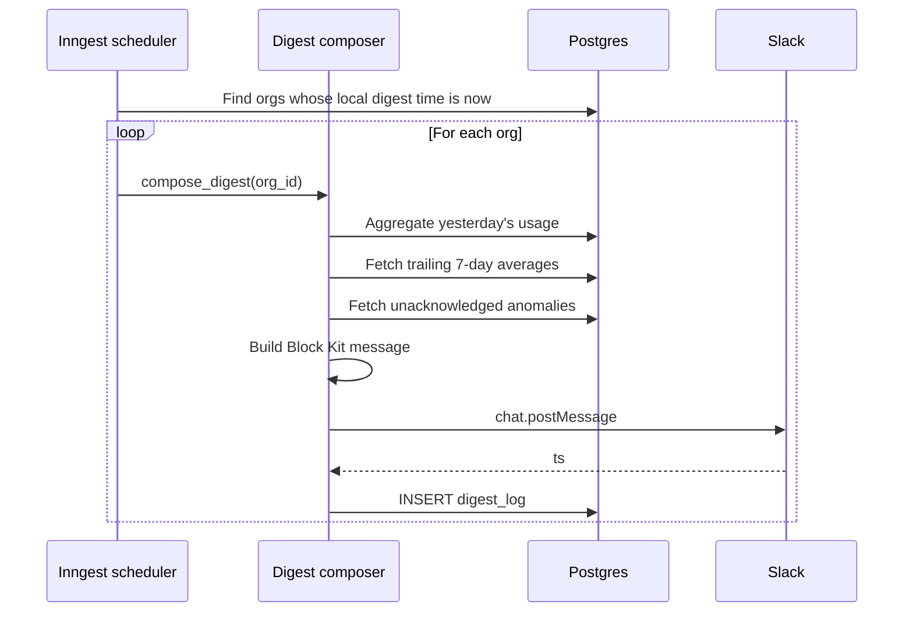
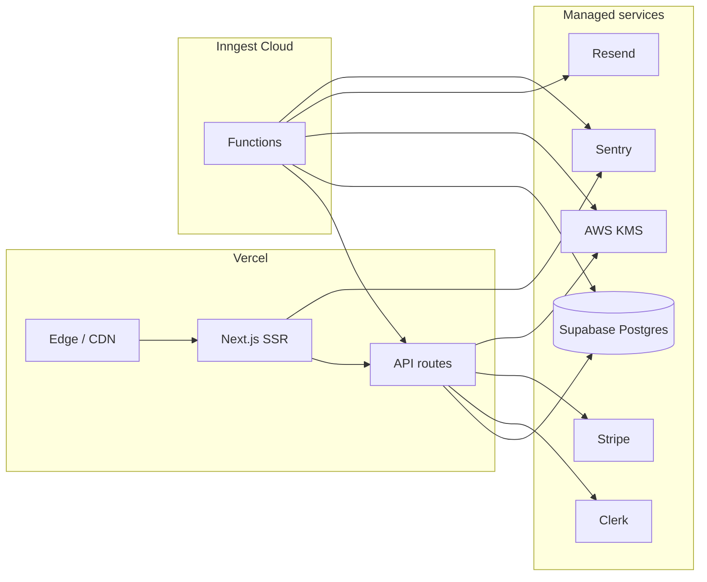

# Architecture

This document describes how the system is built. It complements `CLAUDE.md` (which covers *why* and *what*) by describing *how*. If you change something here, also reconcile it with CLAUDE.md's load-bearing decisions.

---

## 1. System overview

Three planes:

- **Web plane** — Next.js app. Marketing pages, admin UI, OAuth callbacks, Stripe webhooks, internal API routes.
- **Worker plane** — Inngest functions. Scheduled ingestion, anomaly detection, digest composition, Slack/Linear delivery.
- **Data plane** — Postgres (managed). Single source of truth. No separate cache, queue, or search service in v1.



**Why three planes:** keeps user-facing latency (web) decoupled from long-running provider polls (workers) and ensures a database outage degrades cleanly (web returns 503, workers retry).

---

## 2. Component responsibilities

### Web plane (Next.js, Vercel)

- **Marketing pages** — static, ISR where useful.
- **Authenticated admin UI** — org settings, developer management, provider key entry/rotation, integration setup, billing.
- **OAuth callbacks** — Slack, Linear, Clerk.
- **Webhook receivers** — Stripe (subscription events), Slack (slash commands, interactivity).
- **Internal API routes** — invoked by the UI; never directly by workers.
- **No direct provider polling.** The web tier never calls Anthropic/OpenAI/GitHub on a user request path. All such calls happen in workers.

### Worker plane (Inngest)

- **Ingestion functions** — one per provider, fan-out per `provider_key`. Triggered on cron (hourly) and on-demand (key added → immediate backfill).
- **Anomaly detection function** — runs after each org's ingestion completes. Computes rolling stats, writes to `anomalies`, fans out notifications.
- **Digest composer** — daily and weekly, scheduled per-org based on the org's configured local time.
- **Notification dispatch** — formats Slack Block Kit messages and Linear GraphQL mutations, with retry and dead-letter behavior.
- **Maintenance functions** — Stripe sync reconciliation, expired key cleanup, data retention enforcement.

Each function is independently retryable, idempotent, and observable.

### Data plane (Postgres)

- Single managed Postgres instance (Supabase or Neon).
- Row-level security policies enforce `org_id` scoping.
- `pgcrypto` extension used for application-layer encryption helpers (KMS is the master, pgcrypto is occasionally used for hashing/fingerprinting).
- No read replicas in v1. Add when read load demands it (likely never at our scale).
- Daily snapshot backups via the managed provider; point-in-time recovery enabled.

---

## 3. Data model

See CLAUDE.md for the table summary. This section covers relationships, indexes, and design notes.

### Entity relationships



### Key indexes

```sql
-- Hot path: daily digest queries
CREATE INDEX idx_usage_events_org_bucket
  ON usage_events (org_id, time_bucket DESC);

-- Per-developer rollups
CREATE INDEX idx_usage_events_org_dev_bucket
  ON usage_events (org_id, developer_id, time_bucket DESC);

-- Anomaly detection rolling window
CREATE INDEX idx_usage_events_dev_bucket
  ON usage_events (developer_id, time_bucket DESC);

-- Ingestion idempotency (also serves as unique constraint)
CREATE UNIQUE INDEX uniq_usage_events_natural_key
  ON usage_events (provider_key_id, time_bucket, model);

-- Anomalies feed
CREATE INDEX idx_anomalies_org_unack
  ON anomalies (org_id, detected_at DESC)
  WHERE acknowledged_at IS NULL;
```

### Money and time

- `cost_usd_micros bigint` — never floats for currency. `$1.00 = 1_000_000`.
- All `timestamptz`, stored UTC. `time_bucket date` is in UTC (this is an explicit, documented choice — see §10).
- Display conversion to local time happens at the edge in the user's browser.

### Soft delete

`organizations`, `developers`, `provider_keys` use `deleted_at timestamptz`. Hard-deletes only run as part of a customer-initiated GDPR/data-deletion request, executed by a maintenance worker.

---

## 4. Multi-tenancy and isolation

Every row in customer-data tables carries `org_id`. Two layers of defense:

**Layer 1 — Application code.** Every Drizzle query is scoped by `org_id`. We never `SELECT * FROM usage_events`. The org_id comes from the authenticated session (web) or the job payload (workers); it is *never* taken from a user-supplied parameter.

**Layer 2 — Postgres RLS.** Every customer-data table has a policy roughly like:

```sql
CREATE POLICY tenant_isolation ON usage_events
  USING (org_id = current_setting('app.current_org_id', true)::uuid);
```

The app sets `app.current_org_id` at the start of each request/job. If we forget to scope a query, RLS returns zero rows rather than leaking data across orgs.

**The exception:** maintenance functions that need cross-org reads (e.g., billing reconciliation) run as a privileged Postgres role that bypasses RLS. These functions live in a separate code directory (`workers/admin/*`) and are explicitly audited.

---

## 5. Security architecture

### Provider key lifecycle



### Envelope encryption details

- **Master key:** KMS-managed customer master key (CMK), one per environment.
- **Data key:** Per-row, generated by KMS at insert time.
- **Cipher:** AES-256-GCM with random 96-bit IV per encryption. IV and auth tag stored alongside ciphertext.
- **Key rotation:** CMK has automatic annual rotation enabled. Data keys don't need rotation since each is one-use.
- **What's loggable:** only the 4-character `key_fingerprint` (last 4 characters of the original key, e.g. `...x9K2`). Plaintext keys never enter logs, error messages, or Sentry events.

### Authentication and authorization

- **User auth:** Clerk. Sessions are JWT-based, validated server-side on every request.
- **Org membership:** Stored in Clerk organization metadata, mirrored to our `users.org_id` on signup/invite.
- **Roles:** `admin` (manage developers, keys, billing) and `member` (read-only dashboard). Enforced in API route middleware.
- **Worker auth:** Inngest signs every function invocation with a shared HMAC secret. Functions verify the signature before executing.

### Webhook security

- **Stripe webhooks:** verified with Stripe's signature header against the endpoint secret.
- **Slack events:** verified with Slack's signing secret and timestamp window (5 min).
- **Linear:** webhooks not used; we only call Linear's GraphQL API outbound.

### Network egress

- All outbound API calls go through a single HTTP client wrapper that enforces TLS 1.2+, sets a 30s timeout, and tags requests with org_id for tracing.
- No public worker endpoints. Inngest invokes our deployed Next.js routes; the routes verify the signature.

---

## 6. Data flow: Ingestion



**Why 48 hours of overlap on each poll:** providers (especially Anthropic) revise the last 24–72 hours of usage data as late events flow in. We re-pull and let the upsert reconcile. The unique constraint on `(provider_key_id, time_bucket, model)` means re-pulls are safe.

**Failure handling per key:**
- Transient errors (5xx, network, rate limit): exponential backoff with jitter, max 5 attempts. Inngest handles retries.
- Auth errors (401/403): mark key `status = 'errored'`, surface in admin UI, stop polling until rotated.
- Persistent errors after 24h: notify the org admin via Slack/email.

A failed key never blocks other keys in the same org. The org orchestrator runs them in parallel with `Promise.allSettled`.

---

## 7. Data flow: Anomaly detection



**Why not ML.** Engineering managers don't trust black-box alerts. A simple "this developer spent 4× their normal yesterday" is actionable; a model-derived score is not. Revisit only if false-positive rates become a real complaint.

**Suppression rules:**
- A developer flagged today won't re-flag for the same anomaly kind for 24 hours.
- An org with fewer than 7 days of history doesn't get anomaly detection (insufficient baseline).
- Anomalies under $5 absolute change are filtered (don't alert on noise).

---

## 8. Data flow: Daily digest



Digests run from a single scheduled function that queries for "orgs due now" every 15 minutes, rather than per-org cron entries. This keeps the scheduling configuration in the database, not in code.

---

## 9. Deployment topology



**Environments:** `dev` (local), `preview` (per-PR Vercel deployment + isolated Inngest env + branch Postgres), `production`.

**No self-hosted infrastructure** in v1. Every component is managed. The cost is ~$100–200/month at zero customers and scales sub-linearly with customer count for at least the first 1,000 orgs.

---

## 10. Important design choices and their tradeoffs

### UTC time buckets vs per-org local time
Daily totals are bucketed in UTC. A developer working in Tokyo sees their "Monday total" cover their local Sunday-Monday span. This is a known imperfection. The alternative — per-org local bucketing — multiplies storage and complicates cross-org analytics. Revisit if customers complain.

### Single Postgres for everything
No Redis, no separate analytics DB, no search service. Postgres is more than capable at our scale (rolling stats over a few million rows per org is trivial). Resist the urge to add specialized stores until query latency demands it.

### Inngest over a self-managed queue
Inngest gives us scheduled functions, retries, dead-letter handling, observability, and step-function semantics out of the box. The lock-in cost is acceptable; we'd build worse versions of these ourselves.

### Drizzle over Prisma
Drizzle's query builder is closer to SQL, which matters because our query patterns are analytical (rollups, window functions) more than transactional. Migration ergonomics are slightly worse than Prisma's; we accept it.

### Clerk over rolling our own auth
Auth is a tax, not a differentiator. Clerk handles SSO when we eventually need it without rewriting our authentication stack.

### No GraphQL, no tRPC
Internal API routes are plain Next.js Route Handlers returning JSON, typed end-to-end with shared Zod schemas. tRPC was considered; the additional abstraction wasn't worth the lock-in given our small API surface.

---

## 11. Failure modes

| Failure | Detection | Behavior | Recovery |
|---|---|---|---|
| Provider API down | 5xx or timeout on poll | Retry with backoff, mark transient | Auto-recovers on next cron |
| Customer's provider key revoked | 401 from provider | Mark key `errored`, notify admin | Admin rotates key in UI |
| Slack workspace uninstalled us | `account_inactive` on post | Mark Slack install inactive, email admin | Admin reinstalls |
| Stripe subscription canceled | Stripe webhook | Mark org `past_due`, stop ingestion after 7-day grace | Admin updates billing |
| Postgres unavailable | Connection errors | Web returns 503; workers retry; Inngest queues | Auto-recovers when DB returns |
| KMS unavailable | Decrypt error | Workers retry; ingestion delayed | Auto-recovers; alert if >1h |
| Anomaly false positive | Customer feedback | None automatic | Tune thresholds in `lib/anomaly/config.ts` |
| Ingestion job hung | Inngest timeout (>15min) | Auto-killed and retried | Idempotent, safe to retry |
| Daily digest missed | `digest_log` row missing for org+day | Recovery job re-runs at next scheduled tick | Customer sees a late digest |

---

## 12. Observability

- **Errors:** Sentry, tagged with `org_id`, `user_id`, `provider`, `job_name`.
- **Logs:** structured JSON to platform stdout (Vercel and Inngest collect). No external log aggregator in v1.
- **Metrics:** ingestion success rate, digest delivery rate, anomaly false-positive rate (manual, from customer feedback). Tracked via Inngest's built-in dashboards and a weekly admin email.
- **Customer-facing status:** simple status page (statuspage.io or homegrown) showing ingestion health. Add when first customer asks.

---

## 13. Scaling considerations

Approximate inflection points:

- **0–100 orgs:** current architecture as-is. ~$200/month all-in.
- **100–1,000 orgs:** still fine. May need to move from Supabase's hobby tier to Pro. Inngest's free tier becomes paid around 100 orgs.
- **1,000–10,000 orgs:** consider sharding ingestion by org_id hash across multiple Inngest function instances. Postgres still single-instance.
- **10,000+ orgs:** rethink. Probably a read replica, separate analytics DB (DuckDB or ClickHouse for rollups), and per-region deployment for latency.

We are nowhere near these inflection points. **Don't pre-optimize.** The architecture in this document is sufficient for the first three years of plausible growth.

---

## 14. What's deliberately not here

- **Search.** No global search across usage events. If we add it, Postgres full-text first, not Elasticsearch.
- **Analytics SDK / events.** PostHog if we add product analytics. Not in v1.
- **Public API.** No customer-facing API. Add only if customers ask and are willing to pay for Pro.
- **Mobile.** Slack *is* the mobile experience.
- **Real-time updates.** Daily/weekly digest is the rhythm. No WebSockets, no live dashboard. Add only on real demand.
- **Multi-region.** US-only in v1.

---

## 15. Open questions to resolve in build

These are unresolved at write-time. Decide explicitly when each comes up, then update this doc.

1. **Per-developer Slack DMs vs channel-only digests?** Some managers want public visibility; others want per-dev DMs. Likely an org setting, but design needed.
2. **Anomaly threshold defaults — `mean + 3·stddev` or `mean + 2·stddev`?** Calibrate against first 10 customers' data.
3. **Backfill window on key add — 30 days or 90?** 30 is faster and cheaper on provider API quotas; 90 gives better immediate anomaly baselines.
4. **Handling of cached tokens in cost attribution.** Anthropic's prompt caching shows up as a different line item; do we attribute the savings to the developer who created the cache, or the one who hit it?
5. **GitHub Copilot data granularity.** Their billing API is org-level, not per-developer. Either we punt on Copilot in v1 or we present it as an org-wide line item separate from per-developer breakdown.
