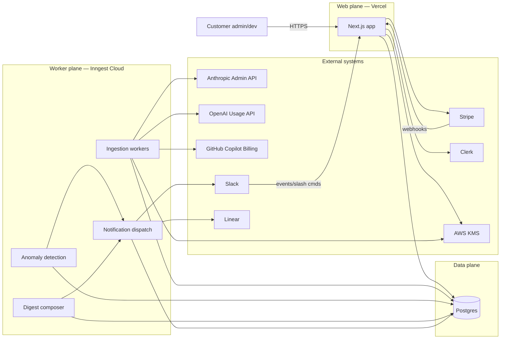
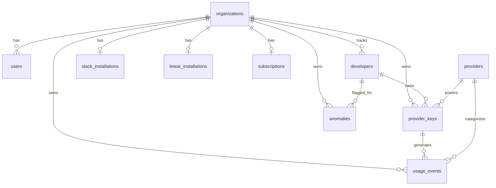
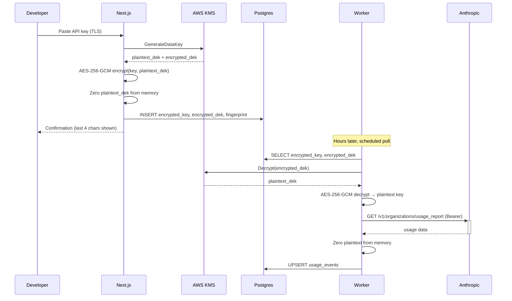
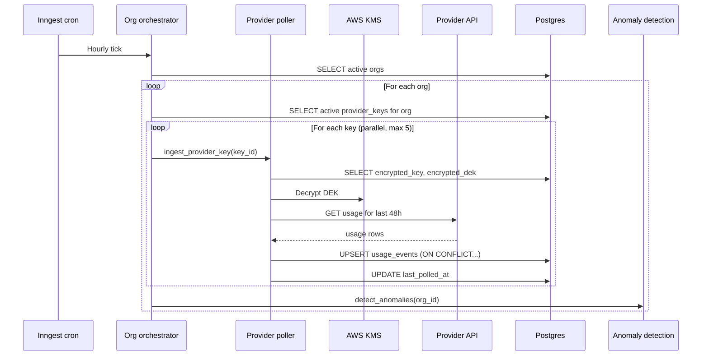
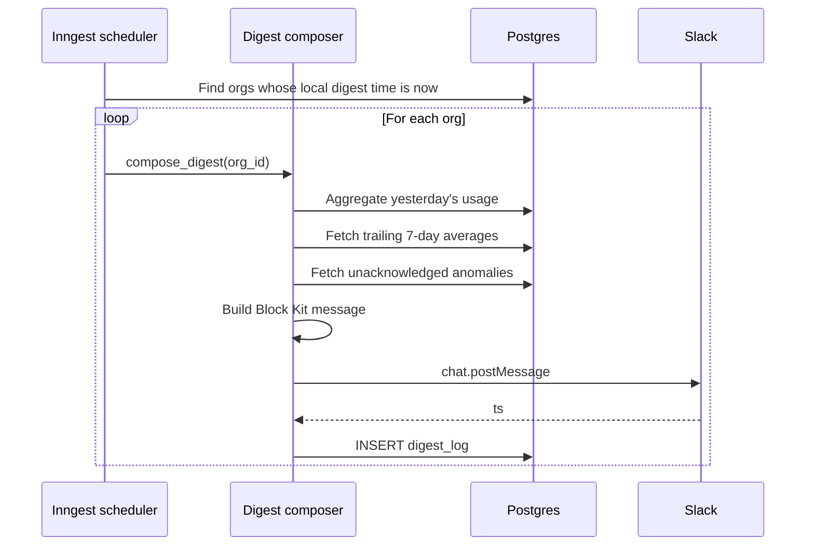
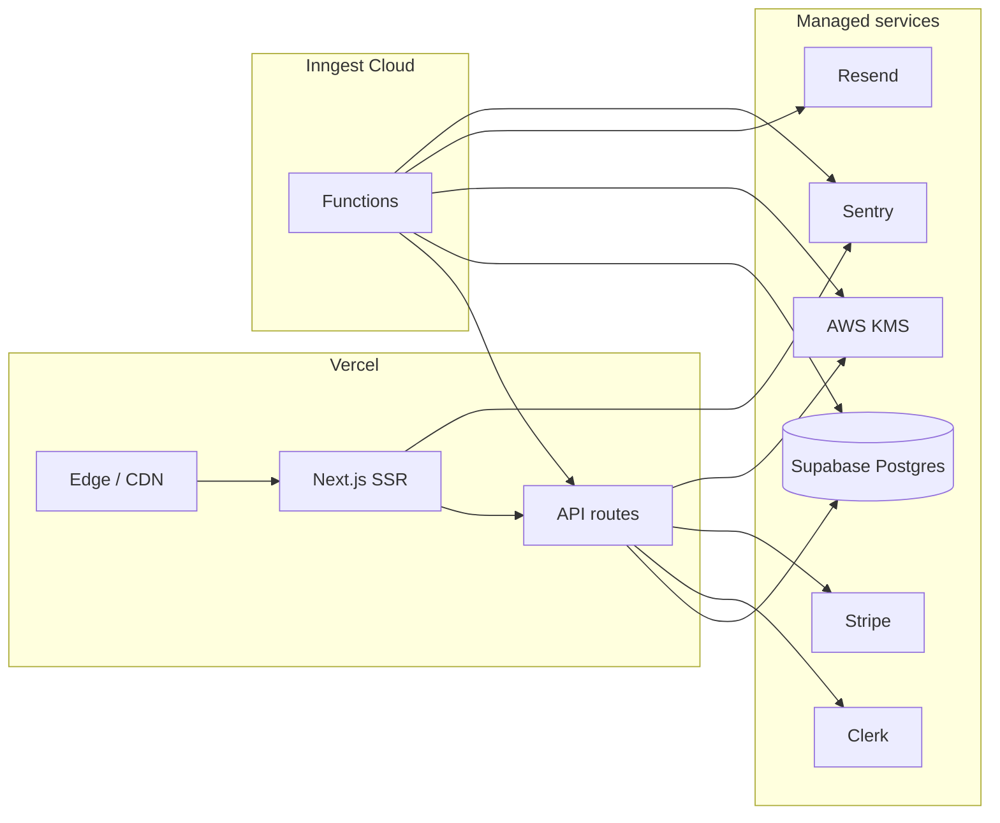

# Architecture

This document describes how the system is built. It complements `CLAUDE.md` (which covers *why* and *what*) by describing *how*. If you change something here, also reconcile it with CLAUDE.md's load-bearing decisions.

---

## 1. System overview

Three planes:

- **Web plane** — Next.js app. Marketing pages, admin UI, OAuth callbacks, Stripe webhooks, internal API routes.
- **Worker plane** — Inngest functions. Scheduled ingestion, anomaly detection, digest composition, Slack/Linear delivery.
- **Data plane** — Postgres (managed). Single source of truth. No separate cache, queue, or search service in v1.



**Why three planes:** keeps user-facing latency (web) decoupled from long-running provider polls (workers) and ensures a database outage degrades cleanly (web returns 503, workers retry).

---

## 2. Component responsibilities

### Web plane (Next.js, Vercel)

- **Marketing pages** — static, ISR where useful.
- **Authenticated admin UI** — org settings, developer management, provider key entry/rotation, integration setup, billing.
- **OAuth callbacks** — Slack, Linear, Clerk.
- **Webhook receivers** — Stripe (subscription events), Slack (slash commands, interactivity).
- **Internal API routes** — invoked by the UI; never directly by workers.
- **No direct provider polling.** The web tier never calls Anthropic/OpenAI/GitHub on a user request path. All such calls happen in workers.

### Worker plane (Inngest)

- **Ingestion functions** — one per provider, fan-out per `provider_key`. Triggered on cron (hourly) and on-demand (key added → immediate backfill).
- **Anomaly detection function** — runs after each org's ingestion completes. Computes rolling stats, writes to `anomalies`, fans out notifications.
- **Digest composer** — daily and weekly, scheduled per-org based on the org's configured local time.
- **Notification dispatch** — formats Slack Block Kit messages and Linear GraphQL mutations, with retry and dead-letter behavior.
- **Maintenance functions** — Stripe sync reconciliation, expired key cleanup, data retention enforcement.

Each function is independently retryable, idempotent, and observable.

### Data plane (Postgres)

- Single managed Postgres instance (Supabase or Neon).
- Row-level security policies enforce `org_id` scoping.
- `pgcrypto` extension used for application-layer encryption helpers (KMS is the master, pgcrypto is occasionally used for hashing/fingerprinting).
- No read replicas in v1. Add when read load demands it (likely never at our scale).
- Daily snapshot backups via the managed provider; point-in-time recovery enabled.

---

## 3. Data model

See CLAUDE.md for the table summary. This section covers relationships, indexes, and design notes.

### Entity relationships



### Key indexes

```sql
-- Hot path: daily digest queries
CREATE INDEX idx_usage_events_org_bucket
  ON usage_events (org_id, time_bucket DESC);

-- Per-developer rollups
CREATE INDEX idx_usage_events_org_dev_bucket
  ON usage_events (org_id, developer_id, time_bucket DESC);

-- Anomaly detection rolling window
CREATE INDEX idx_usage_events_dev_bucket
  ON usage_events (developer_id, time_bucket DESC);

-- Ingestion idempotency (also serves as unique constraint)
CREATE UNIQUE INDEX uniq_usage_events_natural_key
  ON usage_events (provider_key_id, time_bucket, model);

-- Anomalies feed
CREATE INDEX idx_anomalies_org_unack
  ON anomalies (org_id, detected_at DESC)
  WHERE acknowledged_at IS NULL;
```

### Money and time

- `cost_usd_micros bigint` — never floats for currency. `$1.00 = 1_000_000`.
- All `timestamptz`, stored UTC. `time_bucket date` is in UTC (this is an explicit, documented choice — see §10).
- Display conversion to local time happens at the edge in the user's browser.

### Soft delete

`organizations`, `developers`, `provider_keys` use `deleted_at timestamptz`. Hard-deletes only run as part of a customer-initiated GDPR/data-deletion request, executed by a maintenance worker.

---

## 3a. Attribution model (agents & workflows)

The MVP attributes spend to a **developer**. Agents and workflows add a second, finer attribution axis: *which workflow/agent burned this?* — the question that matters once one agent can outspend a whole team. This layer is **derived** and sits entirely on top of `usage_events`. It is added in Phase 8 (prompt 8.1).

### The immutability rule (load-bearing)

`usage_events` is the source of truth and is **immutable and idempotent** on its natural key (`provider_key_id, external_identity, time_bucket, model`). We **never** add a mutable attribution column to it and **never** `UPDATE` a usage row to attach an agent, workflow, run, or customer. Attribution is *derived* and lives in its own recomputable tables, each keyed back to a `usage_events` row. If a mapping changes, we recompute the derived table; the raw ledger never moves.

This keeps re-ingestion, retries, and provider back-revisions safe (the ledger invariant is untouched) and lets us re-derive attribution from scratch at any time without risk to the underlying numbers.

### Tables

All five are org-scoped (`org_id NOT NULL`) and carry the standard RLS policy
`USING (org_id = current_setting('app.current_org_id', true)::uuid)` — see §4. Drizzle does not manage policies, so each is enabled in the migration alongside the table (mirroring `0002_enable_rls.sql`).

- **`agents`** — a named agent whose spend we attribute (`name`, `description`, `status` = `active | archived`). A product/automation, not a person.
- **`workflows`** — a logical run-path. `agent_id` is a **nullable** FK to `agents` (a workflow may stand alone or belong to an agent). `name`, `description`, `status` = `active | archived`.
- **`workflow_runs`** — a single execution of a workflow. `external_run_id` is the customer's own run/trace id (from observability or the SDK), **nullable**, and **unique per `(org_id, workflow_id, external_run_id)` when present** (partial unique index `WHERE external_run_id IS NOT NULL`). Carries `started_at`/`ended_at` (nullable), `status` = `running | completed | failed | unknown`, and `customer_ref` (nullable — the customer's end-customer this run served, for per-customer COGS later). Indexed on `(org_id, workflow_id, started_at)`.
- **`attribution_sources`** — records **how** an attribution was derived, for audit + recompute. `source_type` = `key_mapping | observability | sdk_tag`, a `label`, and a `config` jsonb for source-specific settings.
- **`usage_attribution`** — the **derived join**, recomputable, never the source of truth. One row per `usage_events` row: `usage_event_id` (FK), nullable `agent_id` / `workflow_id` / `workflow_run_id` / `customer_ref`, an `attribution_source_id` (FK, how it was derived), and `confidence` = `exact` (key/tag mapping) or `inferred` (timestamp/fingerprint join). The **unique index on `(org_id, usage_event_id)`** enforces one attribution row per event.

### Recompute strategy

`usage_attribution` is fully derivable from `usage_events` + the active mappings/sources. When a source mapping changes (e.g. a key is reassigned to a different agent), we recompute **per affected event** by **delete + reinsert** of its `usage_attribution` row — idempotent, so re-running yields identical row counts and never duplicates (the unique index on `(org_id, usage_event_id)` guarantees it). At ingest, a new `usage_events` row is attributed inline only when a mapping applies; with no mapping, no attribution row is written and ingestion behaves exactly as before. The raw ledger is read, never written, by any of this.

> Read-performance note: if attribution rollups get slow, the answer is a materialized rollup keyed off `usage_attribution`, **not** denormalizing dimensions onto `usage_events`. The ledger stays immutable.

### Approach A — key/developer → agent mapping (Phase 8.2)

The first agent-attribution source is a pure mapping, no new data feeds. It is adapted to the current attribution model (load-bearing decision #2: one org-wide admin key per provider, with per-identity breakdown), so the mapping attaches at the **identity** and **developer** level rather than at the org `provider_keys` row (which would attribute the whole org to one agent):

- **`provider_identities.agent_id`** (nullable FK → `agents`) — maps a single provider-side identity (an Anthropic `api_key_id`, OpenAI `user_id`, or Copilot seat) to an agent. A customer who mints a dedicated key per agent sees that key as its own identity, so this is the "key → agent" path.
- **`developers.agent_id`** (nullable FK → `agents`) — maps a developer to an agent (the "this dev's key is really the support bot" case).

**Resolution precedence.** For each `usage_events` row the agent is `COALESCE(identity.agent_id, developer.agent_id)` — the identity mapping wins; the developer mapping is the fallback; if neither resolves, the event is left **unattributed** (no `usage_attribution` row). A shared key that serves multiple agents cannot be split at this level — it is left unattributed at the agent level, pending workflow-level attribution (Phase 8.3/8.4).

**Derivation source.** These rows are written with a single per-org `attribution_sources` row of `source_type = key_mapping` and `confidence = exact`, `workflow_id = NULL`.

**ROI honesty — never hide unattributed spend.** Because agent ROI depends on a complete cost denominator, unattributed spend is surfaced, never silently dropped. `lib/attribution/coverage.ts` reports, for a period, total vs agent-attributed spend and the unattributed remainder; the Providers page shows "agent attribution coverage · 30d" and the dollars not attributed to any agent. A shared key that can't be split at the identity level lands in this unattributed bucket until observability attribution (Prompt 8.3) can split it by `workflow_run`. We never guess a split to make coverage look higher.

**Two write paths, both in `lib/attribution/key-mapping.ts`:**
- *Inline at ingest* — the ingestion worker (`lib/jobs/ingest-provider-key.ts`) resolves the agent for each upserted event and writes its `usage_attribution` row when (and only when) a mapping applies. Additive: no mapping → no row, and ingestion behaves exactly as before.
- *Recompute* — `recomputeOrgKeyMappingAttribution(orgId)` does the §3a delete+reinsert for the whole org: delete the org's `key_mapping` rows, then reinsert one per event that resolves to an agent. Idempotent (re-running yields identical counts; guaranteed by the unique `(org_id, usage_event_id)` index). It runs in the `recompute-attribution` Inngest job, fired whenever an identity→agent or developer→agent mapping changes and from the manual "Recompute attribution" action on the Providers page.

---

## 3b. Observability connectors (Langfuse / Helicone)

Approach C reads run/trace metadata from the customer's existing LLM-observability tool and joins it to `usage_events` — the same passive, polled posture as the provider usage APIs (decision #1). It is **not** in the request path.

### Metadata only — the hard rule

We pull **metadata only**: run/trace ids, workflow names, timing, model, and token counts. We **never** request, read, or store prompt/response/input/output content, even when the API returns it. The connector contract (`lib/observability/types.ts`) has no field that can carry message content, and each adapter copies a fixed allowlist of metadata fields — it never references the `input`/`output`/body fields on the upstream objects. Generation token records are used transiently for the join and are **not** persisted as rows.

Persisted fields and their (potentially customer-controlled) sources:
- `workflows.name` ← Langfuse trace `name` / Helicone `session:<id>`. Treated as a **label only**; persisted truncated to a short length so an accidental free-text value can't carry meaningful content.
- `workflow_runs`: `external_run_id` (trace id / session id), `started_at`, `ended_at`, `status`, `customer_ref` (Langfuse `userId` / Helicone user) — `customer_ref` is treated as an opaque end-customer id.
- `observability_connections`: provider, `base_url`, KMS-encrypted credentials (same envelope as `provider_keys`, §-encryption), status, sync timing.

### The (model, day) fingerprint join

Provider usage APIs report **daily aggregates** (`usage_events` is one row per `provider_key × identity × day × model`), so a single observability generation cannot be matched to a per-call usage row. The join therefore operates at the **`(model, day)` grain**: generations are grouped by their model and UTC day, and a `usage_events` row (a model's spend for one day) is attributed to a workflow only when **exactly one** workflow claims that `(model, day)`. Ambiguous days (multiple workflows) are left **unattributed** — no guessing — and surface in attribution coverage (§3a). A `workflow_run_id` is linked only when exactly one run claims the day. Confidence is always `inferred` (daily aggregates carry no provider request id for an `exact` match). The poller logs the match rate (`usage matched / in-window`, `runs linked`); unmatched runs are retained as `workflow_runs` for run-count value.

Cross-source precedence: the observability upsert fills `workflow_id`/`workflow_run_id`/`customer_ref` and preserves any existing agent via `COALESCE(existing agent_id, workflow's agent_id)`, so it never clobbers an `exact` key-mapping agent (§3a). A full precedence/re-derivation engine across sources is deferred.

### Polling

`lib/observability/sync.ts` does the work; `lib/jobs/poll-observability.ts` wraps it as an Inngest function (`observability/poll.requested`) plus an hourly cron (`cron-observability-poll`, offset 30 min after ingestion so the day's `usage_events` are present). Idempotent: workflows upsert by name, runs by `external_run_id`, attribution by the unique `(org_id, usage_event_id)`. Auth errors set `status = error`; transient errors retry. Reads metadata only and never mutates `usage_events`.

---

## 3d. Finance dimensions

The first piece of the Finance tier (Phase 9.1) is **master data**: the dimensions every dollar rolls up to, so spend becomes finance-readable. This prompt adds the master tables and CRUD only — the *allocation* of usage to these dimensions is a separate, derived, recomputable table (Prompt 9.2), never a mutation of `usage_events`.

Five org-scoped tables, each with the standard RLS policy and a unique `(org_id, code)`:

- **`cost_centers`** — `code`, `name`, `parent_id` (self-FK), `owner_ref`, `status`. `parent_id` gives a **hierarchy for rollups** (developer → team → cost center → department); the dimensions UI renders the tree from `parent_id`.
- **`gl_accounts`** — `code`, `name`, `account_type` (`cogs | opex_rnd | opex_ga | opex_sm | other`), `status`. `account_type` is what makes COGS-vs-opex visible at a glance later (margin, accruals).
- **`projects`**, **`product_lines`** — `code`, `name`, `status`.
- **`entities`** — `code`, `name`, `functional_currency` (ISO 4217), `status`. Entity currency feeds period/FX handling downstream; Reckon tags entity-level splits and lets the ERP do the journal/FX (we never compute tax).

All carry a `status` enum (`active | archived`); the UI archives rather than hard-deletes so historical allocations keep their references. Admin CRUD lives under the Finance surface at `/finance/dimensions` (a tab per dimension; cost centers as a tree). **Rollup intent:** spend is aggregated up the `cost_centers` tree and grouped by `gl_accounts.account_type` in the showback views (Prompt 9.4).

---

## 3e. Account determination & cost allocations

A **light**, deterministic, ordered, overridable mapping from usage to finance dimensions (Phase 9.2) — deliberately *not* a general rules engine (Ramp/Coupa own that). `lib/finance/allocate.ts` is the engine.

**Rule evaluation order.** `attribution_rules` are evaluated in `priority` order, **lower wins**. A rule's `match` (jsonb) must hold on every specified key; only `provider`, `model`, `agentId`, `workflowId` are verifiable, so a rule constraining anything else (e.g. `environment`) does **not** match — we never assume an unverifiable constraint holds. The **first** matching rule assigns; later matching rules **fill only still-unset** fields (never overwrite). The first rule to contribute is recorded as `rule_id`.

**Suspense / never-guess.** If no rule assigns a GL account, the event is **never** silently coded. It routes to `coding_status = suspense` (with `gl_account_id` set to the org's configured `organizations.suspense_gl_account_id`) when one exists, else `needs_coding`. The needs-coding queue (`/finance/coding`) lists everything not `coded`, grouped by provider/model/agent; a controller codes a group manually.

**Overrides survive recompute.** Manual codings live in their own durable table, **`cost_allocation_overrides`** (keyed per event) — *not* in the derived output. `cost_allocations` is the recomputable output (one row per usage_event, unique on `(org_id, usage_event_id)`), with `overridden = true` flagging override-sourced rows. Recompute (`recomputeOrgAllocations`) is a **drop-and-rebuild**: delete the org's `cost_allocations`, then recompute each event from rules + overrides + suspense. Because overrides are a separate input, they are re-applied on every rebuild — so `cost_allocations` is **fully derivable from `usage_events` + rules + overrides** (drop and rebuild, counts match), and a manual override always wins and persists. Inline coding at ingest is additive (writes a row only when a rule/suspense codes the event; never clobbers an override via `setWhere overridden = false`). Fired via the `recompute-allocations` Inngest job on any rule/override/suspense change.

**COGS stop-and-ask (gross-margin guard).** Activating a rule that assigns a **COGS** GL account with a **broad** match (empty, or `provider`-only — not narrowed to a model/agent/workflow) is gated: `saveRule` throws `COGS_CONFIRM_REQUIRED` and the UI requires explicit confirmation before activating. Misclassifying opex as COGS distorts gross margin, so this is never silent.

---

## 3f. Shared-cost allocation (drivers)

Spend that maps to a shared key/gateway rather than one owner is split across cost centers by a **driver** (Phase 9.3). A rule marks an event as shared by assigning an `allocation_driver_id` (instead of a `cost_center_id`) in its `assign`.

**Driver methods** (`allocation_drivers.method`, with method-specific `config` jsonb):
- `usage_tokens` *(default, fairest for AI)* — split by each target cost center's share of directly-attributed token volume in scope. `config.cost_center_ids` (optional; defaults to all cost centers with usage).
- `even` — equal split across `config.cost_center_ids`.
- `fixed_pct` — `config.weights` `{ ccId: bps }`.
- `headcount` / `revenue` — split by `config.values` `{ ccId: number }`. These are **external numbers we don't hold**; the customer supplies them in config and we **never fabricate** them (the engine refuses to split if values are absent — the stop-and-ask).

**Split representation.** A shared event produces **multiple `cost_allocations` rows** (one per target cost center), each with `allocation_pct` in **basis points** (10000 = 100%). Direct/uncoded events are a single row at `allocation_pct = 10000`. The DB has no unique on `(org, event)` anymore — a direct event has one row, a shared event several — and correctness is by construction: every writer deletes the event's rows before inserting, and recompute is delete-all-then-rebuild. Recompute is two-pass: pass 1 base-codes every event and accumulates per-cost-center token volume; pass 2 emits the split rows.

**Splits sum to exactly 100%.** The split uses **largest-remainder** over the targets so the basis points sum to **exactly 10000** — the rounding residual is distributed, never dropped. If `organizations.rounding_cost_center_id` is configured, the residual lands on that cost center instead. Both paths guarantee an exact 10000-bps sum.

---

## 3g. Finance showback, rollups & budgets

The Finance surface root (`/finance`, Phase 9.4) is **read-only showback finance can trust**. It never mutates `usage_events` or `cost_allocations`.

**Reconciliation by construction.** Rollups read `cost_allocations` via a **LEFT JOIN from `usage_events`**, so every event is represented — uncoded events (no allocation row) fall into an explicit **"Uncoded"** bucket. Allocated cost = `usage_event.cost × allocation_pct ÷ 10000`. We sum the **weighted** value (`cost × pct`) per group and divide by 10000 once at the end, so a shared event's split rows recombine to its exact cost and the **grand total equals raw billed usage exactly**. A shared key visibly fans out across its consuming cost centers.

**Views** (all period-selectable by month, each drills to contributing usage):
- **Cost centers** — rolled up the `cost_centers` tree (each node shows direct + rolled-up subtree total). Weighted sums roll up the tree, divided to micros per node.
- **GL accounts** — grouped with a COGS-vs-opex headline (`gl_accounts.account_type`), so margin-relevant spend is obvious at a glance.
- **Entities** and **Product lines** — flat rollups.

**Budgets.** `budgets(scope_type ∈ {cost_center, gl_account, project}, scope_id, period "YYYY-MM"|"YYYY", amount_micros)` is kept **separate from actuals**; budget-vs-actual is computed at read time. Cost-center actuals roll up the **subtree**. Each row shows variance in $ and %, plus a month-to-date **pace** indicator (budget × day-of-month ÷ days-in-month vs actual) for the current month.

**Privacy — dimensions, not people.** Showback defaults to rolled-up dimensions and shows **no individual developer names**. The drill-through to contributing usage includes developer names **only** when the viewer also holds `operations` surface access (`getDrillAction` passes `hasSurface(user, "operations")`); a finance-only member sees provider/model/cost but no people.

---

## 4. Multi-tenancy and isolation

Every row in customer-data tables carries `org_id`. Two layers of defense:

**Layer 1 — Application code.** Every Drizzle query is scoped by `org_id`. We never `SELECT * FROM usage_events`. The org_id comes from the authenticated session (web) or the job payload (workers); it is *never* taken from a user-supplied parameter.

**Layer 2 — Postgres RLS.** Every customer-data table has a policy roughly like:

```sql
CREATE POLICY tenant_isolation ON usage_events
  USING (org_id = current_setting('app.current_org_id', true)::uuid);
```

The app sets `app.current_org_id` at the start of each request/job. If we forget to scope a query, RLS returns zero rows rather than leaking data across orgs.

**The exception:** maintenance functions that need cross-org reads (e.g., billing reconciliation) run as a privileged Postgres role that bypasses RLS. These functions live in a separate code directory (`workers/admin/*`) and are explicitly audited.

---

## 4a. Surfaces (role-aware app shell)

The app is split into three **surfaces** over one shared data spine (Phase 8.5), each a different audience's lens on the same `usage_events`/attribution data:

- **operations** — the original product: dashboard, developers, providers, observability, anomalies, integrations.
- **workflows** — cost per agent/workflow/run, run distributions, the run explorer.
- **finance** — showback, dimensions, reconciliation, accruals, unit economics (filled in Phases 9–13).

**Access model (not Clerk paid roles).** Access is stored on our own membership row: `users.surfaces surface[]` (`surface` enum = operations|workflows|finance). Defaults: org **admins get all three** (and `hasSurface()` always returns true for admins regardless of the column); new members default to `[operations]`; a finance assignment grants `[finance, workflows]`. Admins set per-member access at `/members`. We deliberately do **not** depend on Clerk custom roles. Surfaces are synced on membership creation (Clerk webhook + onboarding); `lib/auth.ts` exposes `hasSurface(user, surface)` and `requireSurface(surface)`.

**Route structure.** Routes live in Next.js route groups under `app/(app)/`: `(operations)/`, `(workflows)/`, `(finance)/`. Route groups are **URL-transparent** — moving the existing pages into `(operations)/` did not change any URL (`/dashboard` stays `/dashboard`), so no customer deep links broke and no redirects were needed. Account pages (`settings`, `billing`, `members`) stay at the `(app)` top level (role-gated, not surface-gated). Each group has a `layout.tsx` that `notFound()`s a member lacking that surface, so a forbidden deep link 404s. The sidebar renders only the surfaces the member can access.

**Privacy.** The Workflows surface is a product/finance lens, not a people lens: its queries never select developer names, and the run-explorer drill-down exposes only provider/model/token/cost (no developer identity). Finance rollups (Phase 9+) default to dimensions, not individuals.

---

## 4b. Commitments & prepaid credits (Phase 10.4)

Track committed-use deals, enterprise agreements, and prepaid credits — money finance usually can't see until it's wasted. `commitments(provider, type, amount, start/end, effective_rate?, status)`; org-scoped, RLS.

**Drawdown** (`lib/commitments/drawdown.ts`, pure `computeCommitment` + DB loader). Consumed-to-date = observed usage cost for the provider within the term (by provider usage timestamp). The end-of-term position is projected from the **term-to-date daily run-rate** (`consumed / daysElapsed × daysRemaining`, the same simple/explainable method as the invoice forecast). The UI shows the cumulative drawdown curve against the commitment line.

**Alerts** (each states the dollars at risk and the relevant date):
- `overage` — projected end > commitment (unplanned cash at list rate).
- `under_utilization` — projected end < commitment (committed spend left unused).
- `expiry` — a `prepaid_credit` with a remaining balance within 30 days of its end date.

Alerts under $1 are suppressed. A weekly Inngest sweep (`cron-commitment-alerts` → `commitment/alerts.requested`) posts the top-priority alert (overage > expiry > under_utilization) to Slack and, on Pro, files a Linear issue — **deduped** via `last_alert_kind`/`last_alerted_at` (same kind not re-sent within 14 days). Alerting only; no money moves. `effective_rate` (negotiated $/1M units) displays when provided.

---

## 5. Security architecture

### Provider key lifecycle



### Envelope encryption details

- **Master key:** KMS-managed customer master key (CMK), one per environment.
- **Data key:** Per-row, generated by KMS at insert time.
- **Cipher:** AES-256-GCM with random 96-bit IV per encryption. IV and auth tag stored alongside ciphertext.
- **Key rotation:** CMK has automatic annual rotation enabled. Data keys don't need rotation since each is one-use.
- **What's loggable:** only the 4-character `key_fingerprint` (last 4 characters of the original key, e.g. `...x9K2`). Plaintext keys never enter logs, error messages, or Sentry events.

### Authentication and authorization

- **User auth:** Clerk. Sessions are JWT-based, validated server-side on every request.
- **Org membership:** Stored in Clerk organization metadata, mirrored to our `users.org_id` on signup/invite.
- **Roles:** `admin` (manage developers, keys, billing) and `member` (read-only dashboard). Enforced in API route middleware.
- **Worker auth:** Inngest signs every function invocation with a shared HMAC secret. Functions verify the signature before executing.

### Webhook security

- **Stripe webhooks:** verified with Stripe's signature header against the endpoint secret.
- **Slack events:** verified with Slack's signing secret and timestamp window (5 min).
- **Linear:** webhooks not used; we only call Linear's GraphQL API outbound.

### Network egress

- All outbound API calls go through a single HTTP client wrapper that enforces TLS 1.2+, sets a 30s timeout, and tags requests with org_id for tracing.
- No public worker endpoints. Inngest invokes our deployed Next.js routes; the routes verify the signature.

---

## 5a. Invoices & rate snapshots (Phase 10)

Invoice capture is the input to reconciliation (Phase 10.2). Two ingest paths now — **manual** entry and a **billing-API** sync — with a clean seam for emailed-PDF **OCR** later (the `invoice_source` enum includes `ocr`, but OCR/email intake is **not** built; an inbound attachment address is a PII/security surface that needs explicit sign-off first).

**`provider_invoices` / `invoice_line_items`** (org-scoped, RLS). Money in USD micros. Invoices are period- and currency-aware. Billing-API sync (`cron-monthly-invoices` → `invoices/sync.requested`) upserts by `(org, provider, invoice_number)` and lands invoices as **draft** — never auto-confirmed; re-syncing preserves a human `confirmed` status. The original PDF is kept as a stored **file reference** (`pdf_file_ref`), not parsed-text-as-content.

**`expected_credits` — null vs zero (the rule that lets 10.2 catch a *missing* credit).** `credits_applied` is what the invoice says was credited (faithful capture). `expected_credits` is what we were **promised** for the period (manual entry now; sourced from commitments in Phase 12). It is **NULLABLE**: `NULL` means "we don't know what was promised" → 10.2 **skips** the missing-credit check; `0` means "nothing was promised." These are different and never conflated — `expected_credits` is **never defaulted to 0**. `expected_credits_source` (`none | manual | commitment`) records provenance.

**Rate-checkable flag.** A line carries `model + quantity + amount` so a per-model effective billed rate (`amount ÷ quantity`) is derivable. An invoice with ≥1 such line is `rate_checkable = true`; a lump-sum invoice is `false` → 10.2 marks `price_change` uncomputable for it rather than guessing.

**`provider_rate_snapshots` — the point-in-time pricing baseline.** APPEND-ONLY and immutable (a DB trigger blocks `UPDATE`; same discipline as `usage_events`): a rate change is a **new row**, historical rates are never edited. `rate` is stored as **micros per 1,000,000 units** so sub-micro per-token prices stay integers. Captured on the monthly invoice cadence and on-ingest, **stamped with the observation date** (`captured_at` / `effective_from`) — never backdated. Only token-priced providers (Anthropic, OpenAI) have rate rows; seat/pass-through providers have none.

**As-of resolution.** 10.2 resolves the rate effective during a billing period as the snapshot whose `effective_from ≤ periodStart` (and `effective_to` null or ≥ periodStart), latest `effective_from` wins. If **no** snapshot covers the period, that is reported as a **MISSING baseline (low confidence)** — never silently backfilled with the current rate.

---

## 5b. Invoice ↔ usage reconciliation (Phase 10.2 — the crown jewel)

For an invoice's billing period, compare the provider's billed total to Reckon's observed usage and explain every dollar of the delta. `lib/reconciliation/reconcile.ts`; `computeReconciliation` is a **pure** classifier (exhaustively unit-tested), `reconcileInvoice` does the I/O. The headline rule: a fully-explained waterfall must also be a **correctly**-explained one — conservation is necessary but not sufficient; an honest `unknown` beats a forced explanation.

**Period membership (timestamp rule).** An event belongs to the period by its **provider usage timestamp** (`usage_events.time_bucket`, the provider-reported day), **not** our ingest time. This is the difference between a real delta and a boundary artifact.

**Residual-based classification — no double-claim.** `delta = billed − observed`; `remaining = delta`. Each bucket is sized from its **own evidence** and subtracted from `remaining`, so no later bucket re-claims an explained dollar and a first match never absorbs the whole delta. Buckets:
- `tax` (= invoice tax), `credits` (= −credits_applied, a landed credit), `untracked_keys` (billed for models with **zero** observed usage — a blind spot), `price_change` (per observed rate-checkable line: `billed − expectedRate×qty`), `rounding`, `unknown`.
- The **delta-decomposing** buckets sum to delta **exactly**. `missing_credit` is **ADVISORY** and excluded from the conservation sum: an owed-but-absent credit isn't part of `billed − observed` (that's precisely why it's dangerous), so it's flagged separately with the shortfall + a dispute action. `conservationSum()` sums non-advisory buckets and must equal delta.

**Currency.** We never convert. A currency mismatch (`invoice.currency ≠ USD`) short-circuits to a single `fx` discrepancy for the whole delta (documented deviation from the listed bucket order, since cross-currency can't be decomposed without rates we don't hold).

**Rounding threshold.** `max($1, 0.1% of billed_total)`. A residual **above** the threshold may **not** be rounding — it becomes `unknown`. Rationale: real rounding is sub-dollar/sub-permille; anything larger is a genuine unexplained difference that must be surfaced.

**Expected-rate provenance + staleness.** Rates resolve as-of `periodStart` from `provider_rate_snapshots` (§5a). `rate_ref_as_of` (the resolved baseline's `effective_from`) is recorded on the reconciliation. If the baseline **predates `periodStart`** (we have no snapshot captured within the period), `price_change` is flagged **low-confidence** rather than asserting a pricing error; a missing baseline is also low-confidence. A lump-sum invoice (`rate_checkable = false`) makes `price_change` uncomputable — its residual flows to `unknown`, never guessed.

**Expected credits.** Sourced from the invoice's `expected_credits` (manual in 10.1; commitments in Phase 12). `NULL` → the missing-credit check is **skipped** (unknown ≠ zero).

**Late usage / recompute.** `observed_through` records the latest usage ingest time (`updatedAt`) included. If in-period usage is ingested after `computed_at`, the reconciliation is out of date: `refreshReconciliation` **recomputes in place** for `open`/`explained`, but for `accepted`/`disputed` sets `status = stale` and surfaces it for human re-review — a controller's acceptance is a financial conclusion, never silently overwritten. Explicit user recompute (`reconcileInvoice`) is always allowed.

---

## 5c. Invoice forecasting (Phase 10.3)

Project each provider's next invoice from month-to-date usage. Deliberately **simple and explainable** — no opaque dependency (`lib/forecast/forecast.ts`):

```
projected = MTD observed + Σ over remaining days of that day's run-rate
band      = dailyStdDev × √(remaining days)     (std-error of the tail sum)
```

The per-day run-rate is the MTD daily mean, **optionally split weekday vs weekend** when both day-types have data and differ by >15% of the mean (a real signal, not curve-fitting; `seasonality` flag records which was used). The band yields a `±%` confidence interval (`low = max(MTD, projected − band)`, never below what's already spent). Reproducible by hand: e.g. MTD $50 over 5 days, 26 days left → `50 + 26×10 = $310`.

**Accuracy tracking.** Each computed forecast is persisted as a `forecast_snapshots` row, one per `(provider, period, day)` (so the projection trajectory is kept). `getForecastAccuracy` compares the **final** snapshot for a past period against the **actual** invoice for that period (matched by month) and surfaces forecast-vs-actual error — e.g. "Last 3 forecasts within ±4%". Period membership uses the same provider-timestamp rule as elsewhere.

---

## 5d. Close — accounting periods & cutoff (Phase 11.1)

`accounting_periods(entity_id?, period_start, period_end, status open|closed|locked)` model the close calendar (`entity_id` null = org-wide). Closing/locking is a state change here; what it *gates* (no posting to closed periods) is enforced in Phase 13. `lib/close/cutoff.ts`.

**Reporting timezone (the cutoff source).** A period's `[period_start, period_end]` are **local calendar dates** in the reporting timezone, resolved **entity → org → digest**: `entities.reporting_timezone` → `organizations.reporting_timezone` → `organizations.digest_timezone`. We never use naive UTC display as the boundary (the classic close bug). Settable per-org and per-entity at `/finance/periods`.

**The boundary.** A period covers the half-open instant range `[local period_start 00:00, local (period_end + 1 day) 00:00)` — **inclusive start, exclusive end, tz-aware** (`periodBoundsUtc` / `timestampInPeriod` via `date-fns-tz`). So a spike at 23:30 local on the last day lands in the period; 00:00 local the next day does not.

**Usage mapping (daily-aggregate caveat).** `usage_events.time_bucket` is a **UTC daily aggregate** — there is no sub-day time, so a UTC bucket can't be split across two local days. Each bucket is assigned to **exactly one** period by the local date of its **noon-UTC** instant (`usageBucketRange`) — a deterministic, **non-overlapping** partition (adjacent periods never double-count a bucket). Boundary buckets therefore carry ≤1-day tz approximation; this is the honest limit of daily-aggregated source data, documented rather than hidden. Timestamp-precise cutoff (the helper above) is correct for any real timestamp and ready for finer-grained data. `getPeriodUsage` is deterministic; entity-scoped periods filter to usage coded to that entity via `cost_allocations`.

---

## 5e. Close — accrual generation & draft journal entries (Phase 11.2)

The month-end accrual is Reckon's headline close feature: real-time usage is the best estimate of the not-yet-arrived invoice. `lib/close/accrual.ts` (pure `buildAccrualLines` + DB `generateAccrual`).

**Tables (draft-first).** `journal_entries(period_id, type accrual|allocation|true_up|reversal, status draft|approved, idempotency_key, memo, approved_by/at)` — there is **no `posted` status on the JE**; delivery state lives downstream in `export_batches.status` / `posting_log.status` (§5i, Phase 13 export-first), since one flag can't represent "exported a file we can't confirm was imported" vs "posted via API", `journal_entry_lines(gl_account, cost_center, entity?, project?, debit, credit)`, `accruals(period_id, provider?, estimated_amount, tail_forecast_amount, method_note, status, journal_entry_id)`. All org-scoped, RLS.

**Computation.** For the (tz-correct, §5d) period: sum coded usage via `cost_allocations` split by **GL × cost center** (respecting `allocation_pct`), then add the **not-yet-reported forecast tail** (per provider: `projected − MTD`, §5c). The tail is split across the observed GL/CC lines **pro-rata** (largest-remainder, so debits sum exactly), carrying the same coding. The JE is **expense debits by CC/GL + one accrued-liability credit** (`organizations.accrued_liability_gl_account_id`). `estimated = observed + tail`. A `method_note` records exactly how the number was computed (audit evidence).

**Invariants & gates.**
- **Balanced:** `buildAccrualLines` returns `balanced` and `generateAccrual` **refuses to write** an unbalanced entry (debits == credits, always).
- **Idempotent:** `idempotency_key = accrual:{periodId}:all` (unique per org) — regenerating **replaces** an existing draft in place; never duplicates.
- **Draft-first, human approval:** the JE is created `draft` and **never auto-approved**. Approval is a person's action in the UI (`approveAccrualJE`, draft→approved only). Nothing posts externally (Phase 13 delivers via file export); an `approved` accrual **blocks regenerate** so a reviewed conclusion is never silently overwritten.

---

## 5f. Close — reversal, true-up & accrual accuracy (Phase 11.3)

The accrual close loop: an accrual estimates the invoice, then next period it is **reversed** (so the estimate doesn't double-count) and the **actual** invoice is **trued up** against it. `lib/close/reversal.ts` (pure `buildReversalLines` + `buildTrueUpLines`, DB `generateReversal`/`generateTrueUp`/`getAccrualAccuracy`/`getLinkedEntries`).

**Schema additions.** `journal_entry_type` enum gains `reversal`. `journal_entries.source_journal_entry_id` (self-FK) links a reversal/true-up back to its accrual JE — **every linked entry is traceable, never orphaned**. `accruals` gains `actual_amount` + `variance_amount` (set when trued up).

**Reversal** (`buildReversalLines`, pure). Books a draft entry in the **next period for the same scope** (entity, else org-wide) that **swaps debit ↔ credit of every accrual line** — so accrual + reversal nets to **exactly zero on every dimension** (GL × cost center × entity). Idempotency `reversal:{accrualJeId}`. Requires the next accounting period to exist.

**True-up** (`buildTrueUpLines`, pure). Requires a **reconciled actual invoice** (§5b) whose billing month matches the period; refuses otherwise. `variance = actual − estimated`. The variance is split **pro-rata across the accrual's expense lines** (largest-remainder, carrying the same GL/CC dimensions), **sign-aware**: `variance > 0` (under-accrued) books **more expense** (debit); `< 0` (over-accrued) **reverses expense** (credit). One balancing accrued-liability line. Booked in the **accrual's own period**, idempotency `true_up:{accrualJeId}`. Sets the accrual's `actual_amount`/`variance_amount` and status `trued_up`.

**Accuracy** (`getAccrualAccuracy`). Per-period `errorPct = |variance| / actual` over trued-up accruals + a one-line summary ("AI accrual within ±X%") — auditor evidence that the estimate is trustworthy.

**Invariants & gates.**
- **Balanced & draft-first:** both helpers return `balanced`; the DB functions **refuse to write unbalanced** entries and create everything `draft`. Reversal/true-up reuse the accrual's human-approval path (`approveAccrualJE` is the only draft→approved transition); nothing posts externally (Phase 13).
- **Idempotent:** keyed per source JE — regenerating **replaces** a prior draft; an `approved` reversal or true-up **blocks regenerate**.
- **Traceable:** `source_journal_entry_id` ties each reversal/true-up to its accrual; the UI renders the chain accrual → reversal → true-up with each entry's status.

Verified by `scripts/test-accrual-loop.ts` (pure): reversal nets to zero on every dimension; under/over/exact true-ups balance with correct sign and dimensions; `errorPct` math.

---

## 5g. Outcome metrics — the unit-economics numerators (Phase 12.1, playbook §7)

The CFO question shifts from "where did it go?" to "is it worth it?". Reckon already has the **cost** (denominator) at workflow/customer granularity; the customer supplies the **outcome** (numerator) here, and Phase 12.2 divides them into a unit economic. `lib/outcomes/ingest.ts`, `lib/tokens/ingest-token.ts`, route `app/api/ingest/outcomes`, UI `(finance)/finance/outcomes`.

**Tables (org-scoped, RLS).**
- `outcome_metrics(key, name, unit, grain, direction)` — the definition. `grain ∈ {customer, product_line, workflow, org}`; `direction ∈ {higher_is_better, lower_is_better}`. Unique on `(org_id, key)`.
- `outcome_values(metric_id, grain_ref, period_start, period_end, value, source)` — one value per `(metric, grain_ref, period)`. `grain_ref` is the `customerRef` (text) / `product_line_id` / `workflow_id` the value is for; **`''` for org-grain** (NOT NULL, so the unique index + `ON CONFLICT` upsert target stay well-defined — Postgres treats NULL as distinct, which would defeat idempotency). `source ∈ {manual, csv, api}`.
- `ingest_tokens(name, token_hash, token_prefix, scope, status)` — scoped org-level bearer tokens for programmatic push. We store only a **SHA-256 hash + display prefix**, never the plaintext (same no-plaintext-secret rule as provider keys); the plaintext is shown once at creation.

**Value scaling.** `value` (bigint) is stored **scaled ×1,000,000 — the micros convention — for ALL units**, not just money. Parsing (`parseScaledValue`) is integer-only (no float): `"1200.50" → 1_200_500_000`, `"9800" tickets → 9_800_000_000`. This keeps money exact to the cent and makes Phase 12.2 ratios self-normalize: `cost_micros / value` yields dollars-per-unit directly, and `cogs_micros / revenue_micros` is a pure ratio (the ×1e6 cancels).

**Idempotent ingest.** `upsertOutcomeValues` is `ON CONFLICT (metric_id, grain_ref, period_start, period_end) DO UPDATE` (last-write-wins on value + source) — re-loading a period overwrites, never duplicates. The same upsert backs all three paths: manual entry, client-parsed CSV (header-mapped → `grain_ref, period_start, period_end, value`), and the API.

**API ingest** (`POST /api/ingest/outcomes`, `Authorization: Bearer <token>`). The token is hashed and looked up (the app DB role bypasses RLS, so this runs before any org context); org is taken **from the token**, never the request body. Body `{ values: [{ metricKey, grainRef?, periodStart, periodEnd, value }] }` (≤1000), zod-validated; grain consistency is enforced (org-grain rejects a `grainRef`; non-org requires one). Writes upsert with `source = "api"` inside `withOrgContext`.

Verified by `scripts/test-outcomes.ts`: exact value scaling (incl. malformed/over-precision rejection), idempotent overwrite binding to the right grain+period, the API route (401 no-token / 422 unknown-key / 422 grain-mismatch / 200 accepted + correct scaled storage), and RLS policy presence on all three tables.

---

## 5h. Unit economics & margin (Phase 12.2, playbook §7a)

Pairs AI cost (the denominator Reckon has at workflow/customer/product-line grain) with the customer-supplied outcomes (§5g numerators) to answer "is it worth it?". Read/compute only. `lib/unit-economics/compute.ts` (pure helpers + `getUnitEconomics`), `lib/unit-economics/margin-alerts.ts`, `lib/slack/messages/margin.ts`, Inngest `lib/jobs/margin-alerts.ts`. Views: `(finance)/finance/unit-economics` (board number, margin by product line, customer/workflow cost-per-unit, reconciliation) and a **ROI** tab on `(workflows)/workflows` (cost per run vs outcome).

**Exact formulas.** Cost is bigint micros; outcome `value` is stored scaled ×1e6 (§5g), so a money outcome's stored value IS micros. Therefore:
- **Cost per unit** ($/unit, returned as micros = $×1e6): `costMicros × 1e6 ÷ valueScaled`. The ×1e6 scaling cancels, so `$4200 / 9800 tickets → 428571 micros = $0.43/ticket`. **Null when there's no outcome** — never a fabricated ratio. Computed at customer, product_line, and workflow grain (each grain's metrics divided by that grain's cost).
- **AI COGS % of revenue** (basis points, 10000 = 100%): `cogsMicros × 10000 ÷ revenueScaled`. The numerator is **only COGS-coded spend** — `sum(cost × allocation_pct) FILTER (gl_account.account_type = 'cogs') ÷ 10000`. A revenue metric is one whose unit is a money unit (`isRevenueUnit`: starts `usd`, contains `revenue`, or mrr/arr/gmv/bookings).
- **Gross margin** (micros): `revenueScaled − cogsMicros`; **margin %** = `margin × 10000 ÷ revenueScaled`. Reported per product line and as the org board number.

**Cost sourcing & reconciliation.** Per-workflow/customer cost comes from `usage_attribution` joined to `usage_events`; per-product-line and COGS from `cost_allocations` weighted by `allocation_pct` (÷10000, LEFT JOIN so uncoded events still count). `getUnitEconomics` returns a `reconciliation` block proving the **allocated grand total equals raw usage exactly** (and reports attributed customer/workflow totals). Outcome values are matched to the cost window by `period_start ≥ from AND period_end ≤ to` (no fabrication outside the window).

**Margin alerts** (`evaluateMargin`, pure → `detectMarginAlerts`). For any customer/workflow/product line with a revenue outcome: `negative_margin` (critical) when AI cost > revenue — margin at risk = the overage; `erosion` (warn) when AI cost ≥ a threshold share of revenue (default 80%). No revenue → no verdict. The weekly Inngest sweep (`cron-margin-alerts` → `margin-alerts-for-org`, 06:00 UTC Mon) posts to Slack and files a Linear issue on critical (Pro only), reusing Phase 5 plumbing; the weekly cadence is the throttle (no per-item dedup state persisted).

Verified by `scripts/test-unit-economics.ts` (23 checks): cost-per-unit at all three grains, COGS % using only COGS-coded spend (not total), the customer cost-exceeds-revenue alert with correct margin-at-risk, missing-outcome honesty (empty metrics, null ratios), and exact reconciliation to underlying usage.

---

## 5i. Journal-entry export (Phase 13.1, playbook §9) — export-first delivery

Phase 13 feeds the customer's finance system **file-first**: an approved journal entry (§5e–§5f) is rendered to a downloadable, GL-ready file the customer imports themselves. **No credential, no external connection** anywhere in 13.1–13.3 — this is the primary delivery path and the whole credential-free value (see [[project_phase13_export_first]]); a live API push is the optional, demand-pulled 13.4. `lib/export/` (pure formatters + `build.ts`), UI `(finance)/finance/export`.

**Architectural rule (extended).** Draft-first / idempotent / period-lock-aware now explicitly covers the file: *a file the customer may re-import must carry stable line ids and a double-export guard — the same contract as an API post.*

**Tables (org-scoped, RLS).** `export_batches(period_id, target_format, external_batch_id, content_hash, filename, mimetype, body, status, lock_override_reason, supersede_reason, superseded_by_batch_id, generated_by/at, downloaded_at, acknowledged_at)` + `export_batch_entries(batch_id, journal_entry_id)` recording exactly which JEs went into which batch. We store the rendered `body` so a download serves the exact hashed bytes. We **never mark a JE "posted"** — only the batch lifecycle `generated → downloaded → acknowledged` (the customer's own confirmation) or `superseded`.

**Determinism & idempotency.** A formatter is a pure function (canonical JE → file); identical inputs → identical bytes, proven by `content_hash`. `external_batch_id = RCKN-{period}-{sha256(org:period:sorted JE ids)}` is the stable re-import anchor: the same JE set always yields the same id and hash, no matter when regenerated. Volatile data (generation timestamp) is kept on the row, **never in the hashed body**. Every line carries a stable `line_external_id` (org+JE+line) so a double-import is detectable on both sides. The header stamps the period + cutoff basis (timezone, inclusive-start/exclusive-end from §5d).

**Guards.** Before generating, the **double-export guard** checks `export_batch_entries`: any selected JE already in a non-superseded batch blocks the export and returns the conflicting batches; the user must explicitly **supersede** (status→superseded, reason recorded, replacement linked) or exclude it. Regenerating the same set after supersede reproduces the identical `external_batch_id` + `content_hash`. **Period locks:** closed periods export freely; a **LOCKED** Reckon period requires an explicit, recorded `lock_override_reason`. (Stop-and-ask: superseding a batch that was already *downloaded* warns that a supersede + re-import can double-book on the customer's side.)

**Formats.** `generic_csv` ships in 13.1 (the reference); `qbo_iif`, `netsuite_csv`, `intacct_csv`, `xero_csv`, `spend_splits_csv` are registered but throw until 13.2 — a half-built format can't silently emit a bad file. Per-target column contracts go in §5j (13.2).

Verified by `scripts/test-export-engine.ts` (17 checks): generate + downloadable body + period stamping; formatter byte-determinism; guard fires on re-export and the supersede path reproduces an identical hash + logs the reason; locked-period override required and recorded; lifecycle generated→downloaded→acknowledged; view reports counts + history. A grep confirms zero credential/connection surface in the feature.

---

## 5j. Per-target export templates (Phase 13.2, playbook §9a)

The five system-specific formatters registered alongside `generic_csv` (`lib/export/erp.ts`), each a PURE function from the canonical JE to that system's published import shape, plus a blocking validator (`lib/export/validate.ts`). Built to the documented column contract.

**Shared rules.** Posting date = the period end. Amounts are rounded to cents with the sub-cent residual absorbed on the largest debit line (`roundEntryToCents`) so a JE balanced in micros stays balanced in cents. Dimension columns carry whatever code the line holds — Reckon's code until §5k (13.3) maps a real ERP code — and `export_batches.needs_mapping_count` records how many lines still carry a Reckon code so the **UI flags it; an internal label is never silently shipped as final**. Output is byte-deterministic (round-trips through the §5i `content_hash`).

**Column contracts.**
- **`generic_csv`** — the reference (§5i): one row per line, exact micros (not cents), `needs_mapping` column inline.
- **`qbo_iif`** — QuickBooks Desktop IIF general journal. `!TRNS/!SPL/!ENDTRNS` blocks, tab-delimited; first line of each JE → `TRNS`, rest → `SPL`; `AMOUNT` signed (debit +, credit −) summing to 0; `ACCNT` = GL name, `CLASS` = cost center, `DOCNUM` = JE id prefix.
- **`netsuite_csv`** — CSV journal import: `External ID, Date(MDY), Account, Memo, Debit, Credit, Department(cost center), Class(project), Location(entity)`. One `External ID` per JE groups its lines.
- **`intacct_csv`** — GL journal CSV: `Journal(=GJ), Date(MDY), Reference(=batch id), Line, GL Account, Debit, Credit, Memo, Location(entity), Department(cost center), Project`.
- **`xero_csv`** — manual-journal CSV: `Narration, Date(DMY), Description, AccountCode, TaxRate(=No VAT), Amount(signed), TrackingName1/Option1(Cost Center), TrackingName2/Option2(Project)`. Lines group by `Narration`+`Date`.
- **`spend_splits_csv`** — Ramp/Brex coded split, **NOT a JE**: re-codes the period's AI expense (the JE's debit lines only; credit/liability excluded) into `Vendor, Date, Total Amount, Split Amount, Split %, GL Account, Cost Center, Memo`. Percentages use largest-remainder so they sum to exactly 100.00.

**Validators (block generation).** `generic_csv` → balanced in micros. The four GL-journal formats → balanced micros **and** cents, plus every line has a GL account code. `spend_splits_csv` → each entry has ≥1 expense line and every split line has a GL account. A non-empty error list refuses the batch (no invalid file is ever written).

**Real-import caveat.** These are built to each system's published column contract and verified for determinism, balance, and structure — but **importing each file into the live ERP/sandbox is a manual verification step** (Reckon can't authenticate into those tools; that's the whole point of export-first). The playbook's stop-and-ask applies: validate a generated file through the actual import before relying on a format. `qbo_iif` targets QuickBooks **Desktop** (IIF); QBO-online journal import differs and would be a separate format if a customer needs it. Tax-rate/tracking-category/segment names (e.g. Xero `No VAT`, `Cost Center`) must match names that already exist in the customer's org.

Verified by `scripts/test-export-templates.ts` (21 checks): every format byte-deterministic; cents rounding keeps a sub-cent JE balanced; structure + Reckon-code emission; spend-splits excludes the liability line and %s sum to 100; validators block unbalanced / GL-missing / un-splittable entries.

---

## 6. Data flow: Ingestion



**Why 48 hours of overlap on each poll:** providers (especially Anthropic) revise the last 24–72 hours of usage data as late events flow in. We re-pull and let the upsert reconcile. The unique constraint on `(provider_key_id, time_bucket, model)` means re-pulls are safe.

**Failure handling per key:**
- Transient errors (5xx, network, rate limit): exponential backoff with jitter, max 5 attempts. Inngest handles retries.
- Auth errors (401/403): mark key `status = 'errored'`, surface in admin UI, stop polling until rotated.
- Persistent errors after 24h: notify the org admin via Slack/email.

A failed key never blocks other keys in the same org. The org orchestrator runs them in parallel with `Promise.allSettled`.

---

## 7. Data flow: Anomaly detection


**Why not ML.** Engineering managers don't trust black-box alerts. A simple "this developer spent 4× their normal yesterday" is actionable; a model-derived score is not. Revisit only if false-positive rates become a real complaint.

**Suppression rules:**
- A developer flagged today won't re-flag for the same anomaly kind for 24 hours.
- An org with fewer than 7 days of history doesn't get anomaly detection (insufficient baseline).
- Anomalies under $5 absolute change are filtered (don't alert on noise).

### Workflow cost-per-run detector (Phase 8.6)

The same engine also runs over **workflow cost-per-run** — an alert that points at a code path, not a person. For each active workflow it builds a daily series of mean cost-per-run (attributed daily cost ÷ runs started that day) over the trailing 28 days, then reuses the identical thresholding: flag a **spike** when the recent day's mean cost-per-run exceeds `baseline mean + 3·stddev`, or a **sudden increase** when it exceeds `3× baseline mean` (`lib/anomaly/detect-workflows.ts`).

- **Likely cause** is derived from the data and put in the alert: `model_changed` (recent dominant model ≠ baseline), `run_length_grew` (recent tokens-per-run > 1.5× baseline), else `per_call_cost_grew` (same shape, costlier).
- **Floors** so new/quiet workflows don't alert on noise: ≥7 baseline days with runs, ≥10 baseline runs total, ≥3 runs on the recent day; per-run change must exceed $1.
- **Storage:** `anomalies.developer_id` is now nullable; a workflow anomaly sets `anomalies.workflow_id` and `kind = workflow_cost_per_run` (exactly one of developer/workflow is set). The per-developer path is unchanged.
- **Notification:** the Slack builder renders a workflow-named message (before/after cost-per-run, likely cause, link to the workflow detail page); critical severity files a workflow-focused Linear issue. The existing per-developer Slack/Linear path is untouched. The per-developer anomalies list excludes workflow anomalies (its inner join requires a developer), so existing in-app behavior is unchanged.

---

## 8. Data flow: Daily digest



Digests run from a single scheduled function that queries for "orgs due now" every 15 minutes, rather than per-org cron entries. This keeps the scheduling configuration in the database, not in code.

---

## 9. Deployment topology



**Environments:** `dev` (local), `preview` (per-PR Vercel deployment + isolated Inngest env + branch Postgres), `production`.

**No self-hosted infrastructure** in v1. Every component is managed. The cost is ~$100–200/month at zero customers and scales sub-linearly with customer count for at least the first 1,000 orgs.

---

## 10. Important design choices and their tradeoffs

### UTC time buckets vs per-org local time
Daily totals are bucketed in UTC. A developer working in Tokyo sees their "Monday total" cover their local Sunday-Monday span. This is a known imperfection. The alternative — per-org local bucketing — multiplies storage and complicates cross-org analytics. Revisit if customers complain.

### Single Postgres for everything
No Redis, no separate analytics DB, no search service. Postgres is more than capable at our scale (rolling stats over a few million rows per org is trivial). Resist the urge to add specialized stores until query latency demands it.

### Inngest over a self-managed queue
Inngest gives us scheduled functions, retries, dead-letter handling, observability, and step-function semantics out of the box. The lock-in cost is acceptable; we'd build worse versions of these ourselves.

### Drizzle over Prisma
Drizzle's query builder is closer to SQL, which matters because our query patterns are analytical (rollups, window functions) more than transactional. Migration ergonomics are slightly worse than Prisma's; we accept it.

### Clerk over rolling our own auth
Auth is a tax, not a differentiator. Clerk handles SSO when we eventually need it without rewriting our authentication stack.

### No GraphQL, no tRPC
Internal API routes are plain Next.js Route Handlers returning JSON, typed end-to-end with shared Zod schemas. tRPC was considered; the additional abstraction wasn't worth the lock-in given our small API surface.

---

## 11. Failure modes

| Failure | Detection | Behavior | Recovery |
|---|---|---|---|
| Provider API down | 5xx or timeout on poll | Retry with backoff, mark transient | Auto-recovers on next cron |
| Customer's provider key revoked | 401 from provider | Mark key `errored`, notify admin | Admin rotates key in UI |
| Slack workspace uninstalled us | `account_inactive` on post | Mark Slack install inactive, email admin | Admin reinstalls |
| Stripe subscription canceled | Stripe webhook | Mark org `past_due`, stop ingestion after 7-day grace | Admin updates billing |
| Postgres unavailable | Connection errors | Web returns 503; workers retry; Inngest queues | Auto-recovers when DB returns |
| KMS unavailable | Decrypt error | Workers retry; ingestion delayed | Auto-recovers; alert if >1h |
| Anomaly false positive | Customer feedback | None automatic | Tune thresholds in `lib/anomaly/config.ts` |
| Ingestion job hung | Inngest timeout (>15min) | Auto-killed and retried | Idempotent, safe to retry |
| Daily digest missed | `digest_log` row missing for org+day | Recovery job re-runs at next scheduled tick | Customer sees a late digest |

---

## 12. Observability

- **Errors:** Sentry, tagged with `org_id`, `user_id`, `provider`, `job_name`.
- **Logs:** structured JSON to platform stdout (Vercel and Inngest collect). No external log aggregator in v1.
- **Metrics:** ingestion success rate, digest delivery rate, anomaly false-positive rate (manual, from customer feedback). Tracked via Inngest's built-in dashboards and a weekly admin email.
- **Customer-facing status:** simple status page (statuspage.io or homegrown) showing ingestion health. Add when first customer asks.

---

## 13. Scaling considerations

Approximate inflection points:

- **0–100 orgs:** current architecture as-is. ~$200/month all-in.
- **100–1,000 orgs:** still fine. May need to move from Supabase's hobby tier to Pro. Inngest's free tier becomes paid around 100 orgs.
- **1,000–10,000 orgs:** consider sharding ingestion by org_id hash across multiple Inngest function instances. Postgres still single-instance.
- **10,000+ orgs:** rethink. Probably a read replica, separate analytics DB (DuckDB or ClickHouse for rollups), and per-region deployment for latency.

We are nowhere near these inflection points. **Don't pre-optimize.** The architecture in this document is sufficient for the first three years of plausible growth.

---

## 14. What's deliberately not here

- **Search.** No global search across usage events. If we add it, Postgres full-text first, not Elasticsearch.
- **Analytics SDK / events.** PostHog if we add product analytics. Not in v1.
- **Public API.** No customer-facing API. Add only if customers ask and are willing to pay for Pro.
- **Mobile.** Slack *is* the mobile experience.
- **Real-time updates.** Daily/weekly digest is the rhythm. No WebSockets, no live dashboard. Add only on real demand.
- **Multi-region.** US-only in v1.

---

## 15. Open questions to resolve in build

These are unresolved at write-time. Decide explicitly when each comes up, then update this doc.

1. **Per-developer Slack DMs vs channel-only digests?** Some managers want public visibility; others want per-dev DMs. Likely an org setting, but design needed.
2. **Anomaly threshold defaults — `mean + 3·stddev` or `mean + 2·stddev`?** Calibrate against first 10 customers' data.
3. **Backfill window on key add — 30 days or 90?** 30 is faster and cheaper on provider API quotas; 90 gives better immediate anomaly baselines.
4. **Handling of cached tokens in cost attribution.** Anthropic's prompt caching shows up as a different line item; do we attribute the savings to the developer who created the cache, or the one who hit it?
5. **GitHub Copilot data granularity.** Their billing API is org-level, not per-developer. Either we punt on Copilot in v1 or we present it as an org-wide line item separate from per-developer breakdown.
